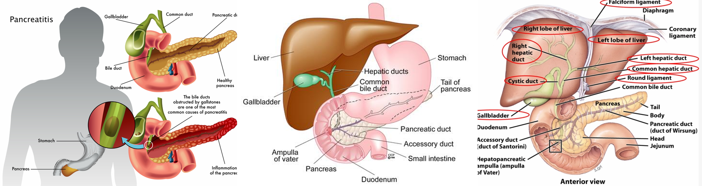

* Pancreatic cancer and cholangiocarcinoma
* Later, I think I need to add corresponding references
* All the figures are only used for non-profit education. reminding me if infrigement happens.
* 

